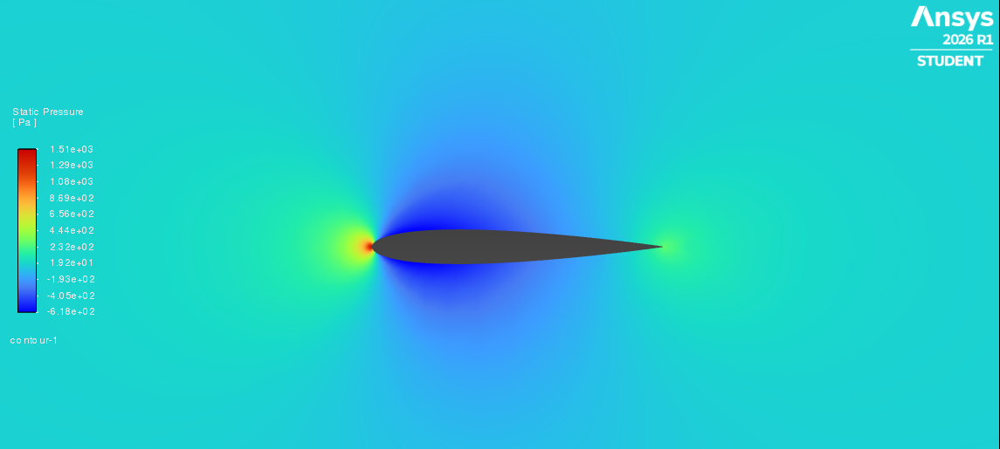
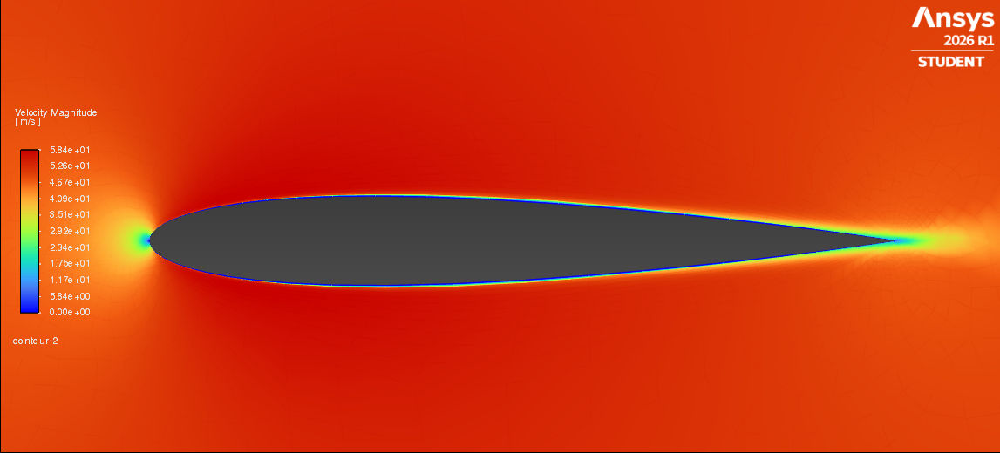

# NACA 0012 Airfoil — CFD Analysis using ANSYS Fluent

  

## Project Overview

This project presents a 2D Computational Fluid Dynamics (CFD) analysis of the NACA 0012 symmetric airfoil using ANSYS Fluent 2026 R1. The simulation covers the complete engineering workflow — from geometry preparation and mesh generation through to solver configuration, post-processing, and result interpretation.

The NACA 0012 is one of the most widely studied airfoil profiles in aerodynamics, making it an ideal benchmark case for validating CFD methodology.

---

## Simulation Parameters

| Parameter | Value |
|---|---|
| Airfoil Profile | NACA 0012 |
| Chord Length | 1 m |
| Freestream Velocity | 50 m/s |
| Angle of Attack | 0 degrees |
| Fluid Medium | Air |
| Flow Type | Steady, Incompressible |
| Solver | Pressure-Based |
| Turbulence Model | K-epsilon Realizable |

---

## Domain and Mesh

| Property | Value |
|---|---|
| Domain Type | Rectangular Far-Field |
| Inlet Distance | 10 chord lengths upstream |
| Outlet Distance | 20 chord lengths downstream |
| Domain Height | 10 chord lengths above and below |
| Total Nodes | 64,165 |
| Total Elements | 63,552 |
| Mesh Type | Unstructured with inflation layers |

The computational domain was sized at 31m x 20m to ensure far-field boundaries do not interfere with the flow field around the airfoil. Inflation layers were applied at the airfoil surface to accurately resolve the boundary layer.

---

## Boundary Conditions

| Boundary | Type | Value |
|---|---|---|
| Inlet | Velocity Inlet | 50 m/s |
| Outlet | Pressure Outlet | 0 Pa (gauge) |
| Airfoil Surface | Wall | No-slip |
| Top and Bottom | Symmetry | — |

---

## Results

### Static Pressure Contour


High stagnation pressure is observed at the leading edge as incoming flow decelerates. Low pressure regions form on the upper and lower surfaces as flow accelerates around the airfoil body — consistent with classical potential flow theory.

**Pressure Range: -618 Pa to +1510 Pa**

---

### Velocity Magnitude Contour


Maximum velocity is observed near the leading and trailing edges where the flow accelerates around the airfoil geometry. A clear boundary layer is visible along the airfoil surface. Freestream velocity of 50 m/s is recovered in the far field.

**Velocity Range: 0 m/s (surface) to 58.4 m/s (peak)**

---

### Force Coefficients

| Coefficient | Value |
|---|---|
| Lift Force | 0.232 N |
| Drag Force | 11.438 N |
| Lift Coefficient (CL) | 0.379 |

At 0 degrees angle of attack, the NACA 0012 is a symmetric profile and theoretically produces zero lift. The small lift value observed is attributed to minor mesh asymmetry at the trailing edge.

---

## Workflow

```
1. Airfoil coordinates generated using NACA 4-series equation (Python)
2. Geometry built in ANSYS DesignModeler — flow domain with airfoil cutout
3. Mesh generated in ANSYS Meshing — unstructured with boundary layer inflation
4. Solver configured in ANSYS Fluent — K-epsilon Realizable turbulence model
5. Solution converged in ~100 iterations
6. Post-processing — pressure and velocity contour plots extracted
```

---

## Tools Used

| Tool | Purpose |
|---|---|
| Python | Airfoil coordinate generation |
| ANSYS DesignModeler | Geometry preparation |
| ANSYS Meshing | Mesh generation |
| ANSYS Fluent 2026 R1 | CFD solver and post-processing |

---

## Key Learnings

- Proper far-field domain sizing is critical for accurate CFD results
- Inflation layers at the airfoil surface significantly improve boundary layer resolution
- K-epsilon Realizable turbulence model is well suited for external aerodynamics
- Solution convergence within 100 iterations indicates a well-conditioned mesh and setup

---

## Author

**Ravindra Singh**  
Aerospace Engineering Graduate (2025)  
Simulation Engineer | CFD & FEA | ANSYS Fluent | MATLAB  
📧 shekhawatravinder152003@gmail.com  
📍 Delhi NCR, India

---

## References

- Abbott, I.H. and Von Doenhoff, A.E. — Theory of Wing Sections, Dover Publications
- ANSYS Fluent Theory Guide 2026 R1
- NACA Technical Report — Characteristics of the NACA 0012 Airfoil
